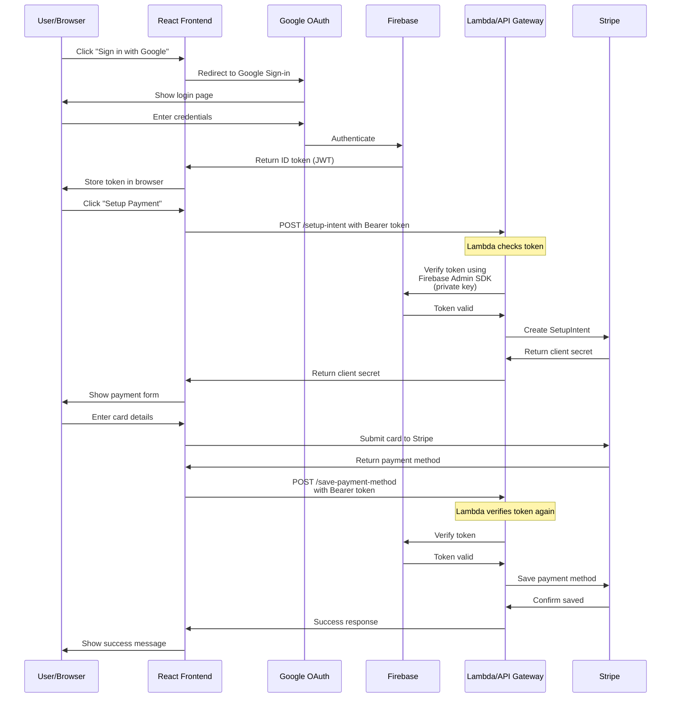

# Authentication and API Request Flow

## Flow Explanation

1. **Initial Authentication:**
   - User clicks "Sign in with Google" in your React app
   - Google OAuth handles login
   - Firebase provides a JWT token
   - Frontend stores this token

2. **API Request Security:**
   - Frontend includes token in all API requests
   - Lambda functions receive requests through API Gateway
   - Lambda uses Firebase Admin SDK (with private key) to verify tokens
   - This ensures only authenticated users can access your API

3. **Why Private Key is Needed:**
   - Frontend: Uses public Firebase config for login
   - Backend: Uses private key to verify tokens
   - Without private key, anyone could forge tokens

4. **AWS Infrastructure:**
   - Frontend: Hosted on S3, served via CloudFront
   - API: Lambda functions behind API Gateway
   - Authentication: Firebase + Lambda verification
   - Payments: Stripe integration via Lambda

This secure setup ensures that:
- Only real Google-authenticated users can access your API
- Tokens cannot be forged
- Sensitive operations (payments) are properly secured
- Frontend and backend are properly separated
